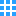
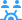

# OpenBridge Shapes

[Home](../../Wiki/Home.md)

These shapes has been developed by the [OpenBridge](https://www.openbridge.no/) project and exported 
by [ioStudioTech](https://www.iostudiotech.com/) from the OpenBridge Figma-library.

The use of the files is limited by the [terms of the OpenBridge project](https://www.openbridge.no/home/terms-of-use).

## TypeShape: Action

|ShapeID|ioShape|
|-----|---|
|Apps||
|Close||
|Edit||
|More||
|Off||
|On||

## TypeShape: Automation

|ShapeID|ioShape|
|-----|---|
|BatteryPack100||
|EthernetSwitch||
|IO||
|Logger||
|Off||
|On||
|PLS||
|Standby||
|Simulation||
|System||

## TypeShape: Command

|ShapeID|ioShape|
|-----|---|
|InCommand||
|LockedCommand||
|NotInCommand||
|RequestCommand||
|SharedCommand||
|TakeCommand||

## TypeShape: Integration

|ShapeID|ioShape|
|-----|---|
|PC||
|Server||

## TypeShape: Maneuvering

|ShapeID|ioShape|
|-----|---|
|Autopilot||
|AutoTrack||
|Joystick||
|Rotate||
|StationKeeping||
|TrackKeeping||

## TypeShape: MotionMeasurements

|ShapeID|ioShape|
|-----|---|
|ROT||

## TypeShape: NavigationInstruments

|ShapeID|ioShape|
|-----|---|
|FrontArrow||
|ContourShip||

## TypeShape: Palettes

|ShapeID|ioShape|
|-----|---|
|BrightDay||
|Day||
|Dimming||
|Dusk||
|Night||

## TypeShape: SensorsNetwork

|ShapeID|ioShape|
|-----|---|
|CellFullSignal||
|GpsSensorFull||
|GyroSensor||
|SatelliteFull||
|WiFi||
|WindSensor||
